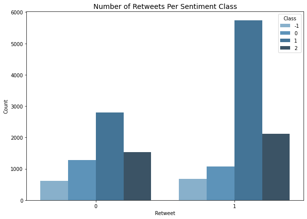
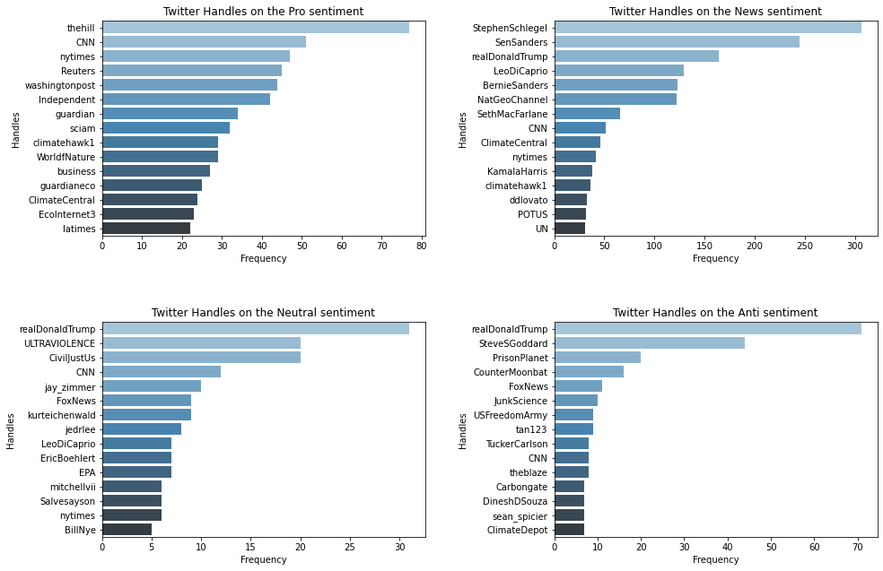

# Climate Change Sentiment Analysis

The objective of this project is to build a machine learning model that can tell whether or not a person believes in climate change based on recent tweet data.

### Project Overview

Many businesses have been motivated by the idea of lowering carbon footprints or environmental impact. They offer environmentally friendly and sustainable products and services in accordance with their values and guiding principles. These companies are curious on how people perceive climate change and if they believe it to be a genuine threat. This would help them in their efforts to conduct market research to ascertain whether or not their product or service may be accepted.

Giving businesses access to a large base of customer opinion, spanning numerous demographic and geographic groups, increases their insights and informs future marketing plans. This work can be solved accurately and robustly.

In light of the above, this project provides a [notebook](ZF2_Classification.ipynb) which contains a step-by-step walkthrough of the development of a machine learning model that can categorize whether a person believes in climate change or not using their novel tweet data.

### Tools and Libraries Used for this project
1. Jupyter notebook 
2. sklearn
3. NLTK 
4. Numpy and Pandas
5. Matplotlib and Seaborn
6. imblearn
7. Comet

### Dataset for this project
The datasets (train and test data) for the project wwere provided by Explore AI Academy. The [train data](data/train.csv) contains three columns including the tweets' unique Id, the message which are the tweets itself and the sentiment of the tweets. The [test dataset](data/test_with_no_labels.csv) is similar to the train dataset except it has no sentiment label 

# Methodology

#### Summary of Exploratory Data Analysis

The bars by the left indicates the total number of tweets in the dataset. From the right hand charts, tweets with pro sentiment has the most retweets, almost twice the number of tweets. This shows that there is a general believe in climate change and its effect.

Donald Trump has the most tweets classified as Neutral or Negative. These tweets do not believe in climate change.

#### Summary of Data Preprocessing 
